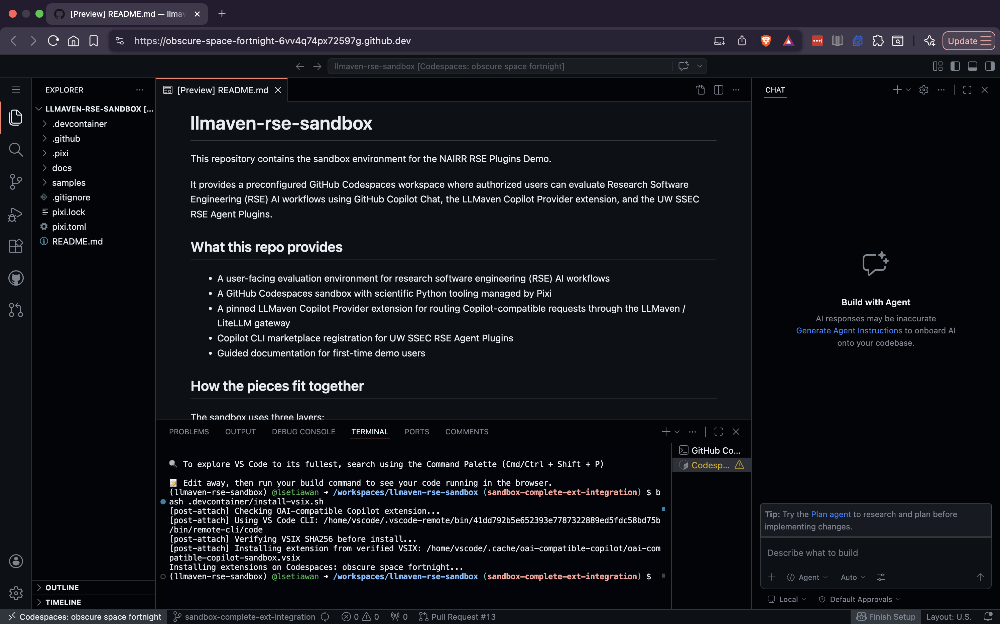
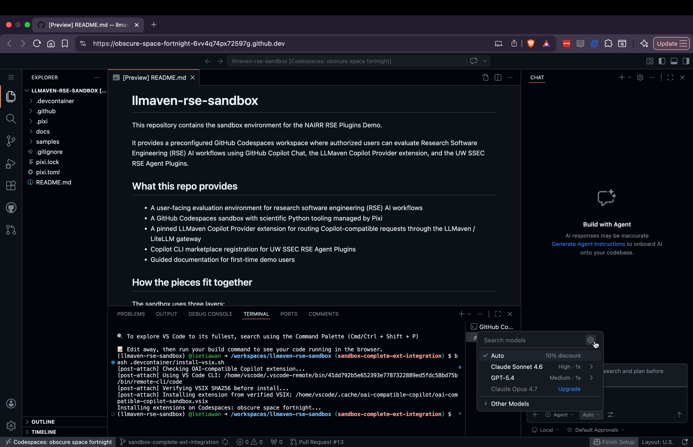
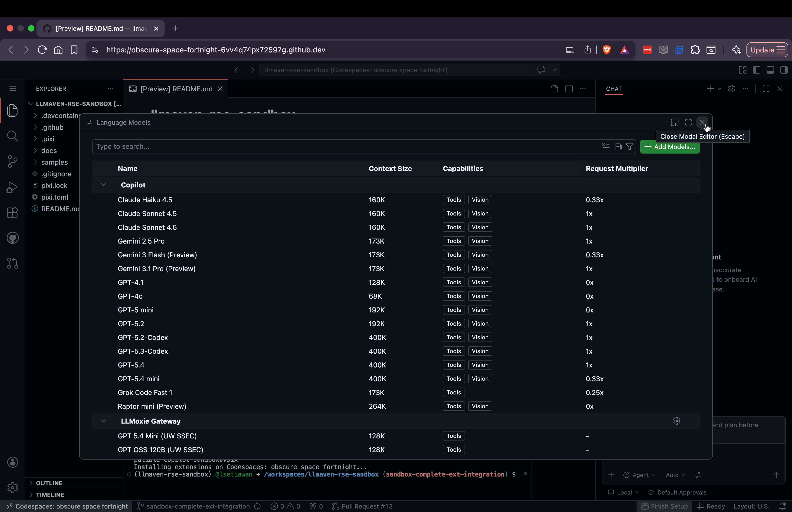
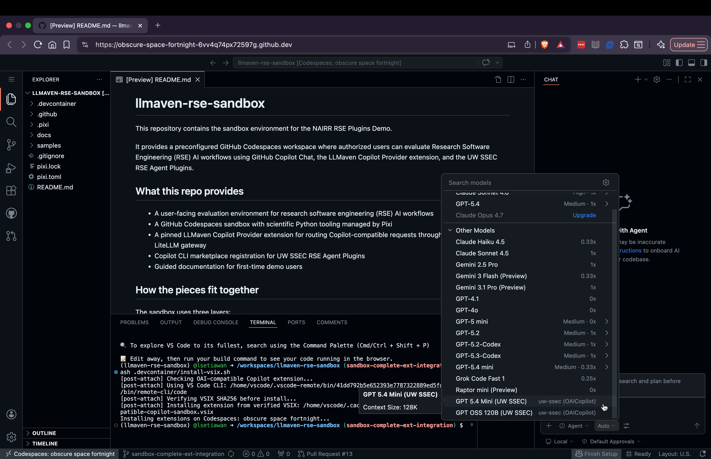

# LLMoxie NAIRR Sandbox

[](https://nairrpilot.org/) [](https://nairrpilot.org/projects/awarded?_requestNumber=NAIRR240292) [](#sandbox-walkthrough)

This repository is a **NAIRR Pilot Sandbox** for exploring AI-assisted Research Software Engineering (RSE) workflows.

NAIRR Pilot Sandbox projects are for any US-based researcher, educator, or student interested in exploring an AI-related example project in a test environment. These Sandboxes are isolated environments for experimentation and development. They allow academics, scientists, and students to try out new features or server configurations, or just play with AI tools without impacting the live system. Think of a sandbox as a playground where you can experiment with different AI tools and ideas without breaking anything that's already working.

This specific sandbox provides a preconfigured GitHub Codespaces workspace for evaluating RSE AI workflows using GitHub Copilot Chat, the LLMoxie Model Provider extension, and the UW SSEC RSE Agent Plugins.

## What this repo provides

- A user-facing evaluation environment for research software engineering (RSE) AI workflows
- A GitHub Codespaces sandbox with scientific Python tooling managed by Pixi
- A pinned LLMoxie Model Provider extension for routing Copilot-compatible requests through the LLMoxie / LiteLLM gateway
- Copilot CLI marketplace registration for UW SSEC RSE Agent Plugins
- Guided documentation for first-time demo users

## How the pieces fit together

The sandbox uses three layers:

```text
GitHub Codespaces
  → provides the reproducible development environment

LLMoxie Model Provider
  → routes Copilot Chat model requests through the LLMoxie / LiteLLM gateway

RSE Agent Plugins
  → provide RSE-specific skills, agents, and slash commands via the Copilot CLI marketplace
```

The Copilot provider extension and the RSE Agent Plugins are separate. The provider handles model routing. The plugins provide the research software engineering capabilities.

## Sandbox walkthrough

Follow these steps to go from opening the sandbox to your first successful RSE workflow interaction.

> **Prefer a guided, slide-by-slide demo?** Open `docs/slides/research-loop.md` and choose
> "Open Preview to the Side" (Marp). It walks you through the full `ai-research-workflows`
> research loop in Copilot Chat — packaging the `samples/` climate scripts — with each
> instruction on screen beside the chat panel.
>
> **Prefer a research story?** `docs/slides/research-loop-ocean.md` tells the same loop as a
> hypothesis-driven oceanographic arc — testing a warming trend in synthetic buoy data — and
> features the `/experiment` and `/reproduce` phases the packaging deck skips.

### Step 1 — Open the Codespace

Start from the authorized onboarding flow or from the repository page and open a GitHub Codespace for this repository.

During first launch, the devcontainer automatically:

- prepares the Pixi Python environment
- downloads and verifies the pinned LLMoxie Model Provider VSIX
- installs the provider extension and configures it to route through the LLMoxie / LiteLLM gateway
- installs the Copilot CLI, wires it to the LLMoxie gateway, and registers the RSE plugin marketplace

You will see setup output in the terminal during first launch. Wait for it to complete before continuing.

Once setup completes, the Codespace is ready for use — the README opens in the editor, the Copilot Chat panel is available on the right, and the integrated terminal shows the post-create output.



### Step 2 — Select a UW SSEC model

The UW SSEC models routed through the LLMoxie / LiteLLM gateway are contributed by the installed LLMoxie Model Provider extension. On first Codespace launch, you need to open the Language Models manager once (Step 2b) so the picker surfaces them — after that, the UW SSEC entries persist in the chat model picker for this Codespace.

**2a. Open the chat model picker.** Open the Copilot Chat panel in VS Code (the speech-bubble icon in the Activity Bar, or `Ctrl+Shift+I`), then click the model name shown next to the input box. The compact picker lists the most common Copilot subscription models (Auto, Claude Sonnet 4.6, GPT-5.4) plus an "Other Models" section that holds the rest.



**2b. Open the Language Models manager (required on first Codespace launch).** In the top-right of the picker popover (next to the "Search models" input), click the gear icon. The **Language Models** manager opens in the editor area, showing two sections:

- **Copilot** — the built-in models available based on your GitHub Copilot subscription (Claude Sonnet 4.6, GPT-5.4, Gemini 2.5 Pro, and so on).
- **LLMoxie Gateway** — the UW SSEC models contributed by the installed LLMoxie Model Provider extension: `GPT 5.4 Mini (UW SSEC)` and `GPT OSS 120B (UW SSEC)`.

The UW SSEC entries are already enabled — no toggling needed. Close the manager when done; the picker will now surface them in Step 2c.



**2c. Select a UW SSEC model.** From the chat model picker, expand "Other Models". The UW SSEC entries appear in the list — `GPT 5.4 Mini (UW SSEC)` and `GPT OSS 120B (UW SSEC)`. Selecting one routes your Copilot Chat requests through the LLMoxie / LiteLLM gateway.



### Step 3 — Verify the stack with Copilot Chat

**Verify in Chat before moving to the CLI.** A simple chat prompt is the fastest way to confirm the full stack — LLMoxie Model Provider, gateway, and selected UW SSEC model — is working end-to-end.

With your UW SSEC model selected, try a simple prompt in the Chat panel:

```text
What is this repository for?
```

If Copilot Chat responds with a description of the sandbox, the provider and gateway are working.

### Step 4 — Explore freely in Copilot Chat

With a model selected, use Copilot Chat for open-ended, conversational work — exploring unfamiliar code, asking design questions, or drafting changes interactively.

```text
What scientific Python packages are available in this workspace, and how is the environment managed?
```

```text
Summarize the structure of the files under samples/ and flag any obvious issues.
```

Note: the UW SSEC RSE Agent Plugins are installed as Copilot **CLI** plugins, not Chat plugins. To invoke plugin-backed workflows (research, planning, handoff, validation), move to the Copilot CLI in Step 5.

### Step 5 — Use the Copilot CLI for RSE plugin workflows

The standalone Copilot CLI is installed in the devcontainer, pre-wired to the LLMoxie gateway, and the `uw-ssec/rse-plugins` marketplace is registered. The CLI is the surface where the RSE Agent Plugins (slash commands, agents, skills) are available.

**When to stay in Chat:**

- Exploring unfamiliar code or tooling interactively
- Back-and-forth design and Q&A

**When to move to the CLI:**

- Invoking RSE Agent Plugin slash commands
- Running plugin-backed tasks non-interactively in a script or CI context
- Piping Copilot output into other shell tools

Start an interactive session from the terminal:

```text
copilot
```

The CLI is pinned to `gpt-5.3-codex` (set via `COPILOT_MODEL`) — it is the only model qualified for the CLI-driven RSE plugin workflows in this sandbox. Do not switch the CLI model with `/model`. Model selection in Copilot Chat (Step 2) is a separate surface and is unaffected.

Try an RSE Agent Plugin slash command (provided by `ai-research-workflows@rse-plugins`):

```text
/research What testing, dependency, and API design issues exist in this repository?
```

```text
/plan Draft a roadmap to improve onboarding and handoff readiness for this project.
```

```text
/validate Identify user, workflow, and design risks in this project.
```

Other commands provided by the plugin: `/experiment`, `/handoff`, `/implement`, `/iterate-plan`.

## Saving your work

This repository is a managed sandbox with restricted write access. To preserve your work outside the provided environment:

1. Fork this repository to your own GitHub account
2. Add your fork as a remote if needed
3. Commit and push your changes to your fork

This keeps the shared sandbox source clean while letting you preserve your own work.

**Heads-up — forking does not carry gateway access.** The LLMoxie / LiteLLM gateway credentials are provisioned for this sandbox specifically and are not part of the repository contents. A GitHub Codespace launched from your own fork will not have those credentials, so Copilot Chat and the Copilot CLI in that Codespace will not be able to route requests through the UW SSEC models. Use the sandbox Codespace for AI-routed workflows; use your fork to preserve code changes.

## Data and evaluation notes

AI interactions in this environment may be routed through the LLMoxie / LiteLLM gateway for research and evaluation purposes. The intended design is to support de-identified logging using session-level identifiers rather than personal identity.

## Trust assumptions

This sandbox installs a pinned LLMoxie Model Provider VSIX during devcontainer setup. The VSIX is verified against a SHA256 value committed in this repository before installation.

The provider extension uses a gateway credential provisioned through the authorized onboarding flow. Use this sandbox only from trusted Codespace sessions created through that flow.
